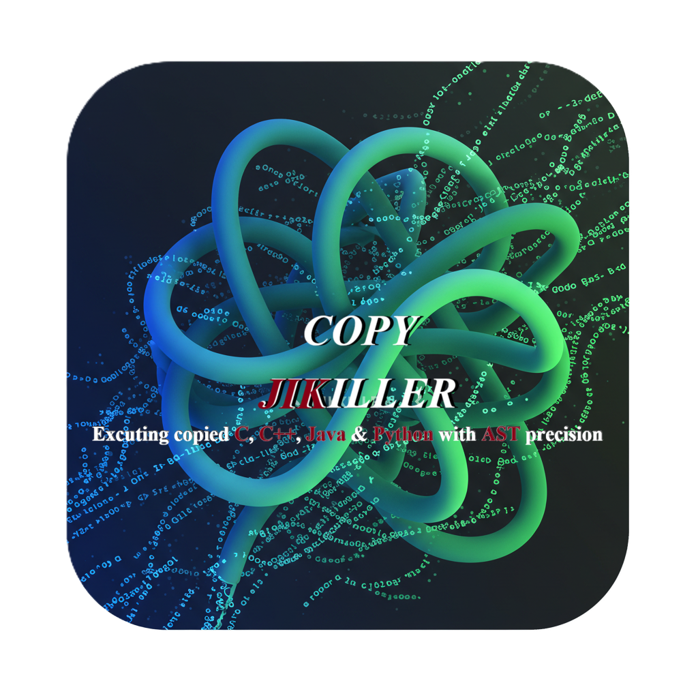

> A Powerful, GUI-based Plagiarism Checker for Programming Assignments.

**COPY_JIKILLER** is a robust desktop application designed to efficiently check for plagiarism in students' code submissions. Going beyond simple text comparison, it utilizes advanced analysis based on [AST (Abstract Syntax Tree)](#-what-is-ast-analysis) to precisely detect various types of plagiarism, including changes in variable names, code order, and more.

---

## Table of Contents

* [Key Features](#-key-features)
* [Detailed User Guide](#-detailed-user-guide)
* [What is AST Analysis?](#-what-is-ast-analysis)
* [Installation & Requirements](#️-installation--requirements)
* [Building from Source](#-building-from-source)
* [License](#-license)

---

## ✨ Key Features

* **Multi-Language [AST](#-what-is-ast-analysis) Analysis**: Supports advanced AST-based analysis for **Python, C/C++, and Java** to effectively detect plagiarism where variable or function names have been altered.
* **Side-by-Side Diff Viewer**: Double-clicking a result opens a new window displaying the two codes side-by-side, with matching parts highlighted for intuitive comparison.
* **Flexible Scan Options**: Provides various options such as recursive subdirectory search, extension filtering, and an adjustable similarity threshold.
* **Convenient & Modern UI**: Ensures a pleasant user experience with a progress bar, ETA, a stop function, and CSV export capabilities. Supports both light and dark modes, automatically detecting the system's theme on first launch.

---

## 🚀 Detailed User Guide

### 1. 📁 Folder Selection & Basic Setup

> This is the first step to begin a scan.

* **Select Folder**: Click the `[Select Folder]` button to choose the directory containing the code files you want to check. This will enable the 'Start Scan' button and lock the settings.
* **Include Subfolders**: When checked, the scan will recursively search through all subdirectories within the selected folder.
* **Extension Filter**: Use the `[Select Extensions]` dropdown menu to toggle which file extensions to check. You can add new extensions with the `[➕]` button or manage (delete) custom extensions with the `[...]` button.

<!-- GIF Placeholder: Demonstrates folder selection and filter setup. -->
<!--  -->

### 2. ⚙️ Analysis Mode & Threshold

> Set the accuracy and criteria for your scan.

* **Analysis Mode**:
  * **Basic Analysis (Text)**: Compares plain text after removing comments and whitespace. It's universally applicable to all languages but has the lowest accuracy.
  * **Python/C++/Java (AST)**: Performs AST analysis for the respective language. This method analyzes the code's structure, making it highly effective at catching plagiarism. **It is strongly recommended to select the mode that matches the language of the code being scanned.**
* **Similarity Threshold**: Adjust the slider to set the minimum similarity percentage (%) for results to be displayed. (Default: 70%)

<!-- GIF Placeholder: Demonstrates selecting an analysis mode and adjusting the threshold. -->
<!--  -->

### 3. ✔️ Running & Stopping the Scan

> Start the scan after completing the setup.

* **Start Scan**: Click the `[✔️ Start Scan]` button to lock the settings and begin the scan.
* **Check Progress**: The status bar at the bottom will display the progress percentage, processed item count, and ETA in real-time. On Windows, the progress is also shown on the taskbar icon.
* **Stop**: Click the `[❌ Stop]` button at any time to immediately halt the ongoing scan.

<!-- GIF Placeholder: Demonstrates starting and stopping a scan. -->
<!--  -->

### 4. 📊 Viewing & Analyzing Results

> Intuitively check for suspected plagiarism.

* **Results List**: After the scan is complete, pairs of files exceeding the set threshold will be listed in descending order of similarity.
* **Diff Viewer**: **Double-click** an item in the list to open a new side-by-side comparison window. The matching parts of the two codes will be highlighted.

<!-- GIF Placeholder: Demonstrates viewing results and using the Diff Viewer. -->
<!--  -->

### 5. 💾 Exporting & Saving Settings

> Save your analysis results and preserve your current settings.

* **Export Results**: Click the `[💾 Export Results]` button to save all items currently displayed in the results list to a **CSV file**.
* **Auto-Save Settings**: The last used **theme, language, and extension filter list** are automatically saved when you close the program and will be restored on the next launch.

<!-- GIF Placeholder: Demonstrates exporting results. -->
<!--  -->

---

## 🔬 What is AST Analysis?
AST stands for **"Abstract Syntax Tree"**.

Instead of viewing code as a simple sequence of characters, an AST represents its grammatical structure (like variable declarations, loops, conditionals, etc.) in a tree-like format, much like a compiler does.

**COPY_JIKILLER**'s AST analysis mode uses this principle to compare the **core logic and structure of the code itself**, ignoring superficial aspects like variable/function names, comments, and whitespace. This makes it highly effective at detecting plagiarism attempts, such as simply renaming variables or reordering code blocks.

---

## 🛠️ Installation & Requirements
### 1. Install Libraries

To install all required libraries at once, navigate to the project's root directory in your terminal and run the following command:
```bash
pip install -r requirements.txt
```
### 2. Additional Setup for C/C++ AST Analysis
To fully use the `C/C++ (AST)` analysis mode, you must have the **LLVM/Clang compiler** installed on your system.
1.  **Install LLVM**: Go to the [LLVM Official Download Page](https://github.com/llvm/llvm-project/releases) and run the installer for your OS.
2.  **IMPORTANT (Windows)**: During installation, make sure to **check the box** for **"Add LLVM to the system PATH for all users"**.

---
## 📦 Building from Source
You can create a standalone executable (`.exe`, `.app`) for easy distribution.
1.  **Install PyInstaller**: `pip install pyinstaller`
2.  **Run Build Command**:
    * Navigate to the project's root directory in your terminal and run the command appropriate for your OS.
    * The **`--add-binary`** option is required to bundle the C/C++ AST analysis feature.

<br>

#### 🪟 **Windows**
* Find the path to your `libclang.dll` file (e.g., `C:\Program Files\LLVM\bin\libclang.dll`).
* Replace the example path in the command below with your actual path.
```bash
pyinstaller --onefile --windowed --name "COPY_JIKILLER" --icon="resource/copy_jikiller.ico" --add-data "resource;resource" --add-data "guide;guide" --add-binary "C:\Program Files\LLVM\bin\libclang.dll;." main.py
```

#### 🍏 **macOS**
* Find the path to your `libclang.dylib` file (e.g., `/opt/homebrew/lib/libclang.dylib` if installed with Homebrew).
* Replace the example path in the command below with your actual path.
```bash
pyinstaller --onefile --windowed --name "COPY_JIKILLER" --icon="resource/copy_jikiller.ico" --add-data "resource:resource" --add-data "guide:guide" --add-binary "/path/to/your/libclang.dylib:." main.py
```

#### 🐧 **Linux**
* Find the path to your `libclang.so` file (e.g., `/usr/lib/x86_64-linux-gnu/libclang.so.1`).
* Replace the example path in the command below with your actual path.
```bash
pyinstaller --onefile --windowed --name "COPY_JIKILLER" --icon="resource/copy_jikiller.ico" --add-data "resource:resource" --add-data "guide:guide" --add-binary "/path/to/your/libclang.so:." main.py
```
---
## 📜 License
This project is licensed under the [MIT License](../LICENSE).
